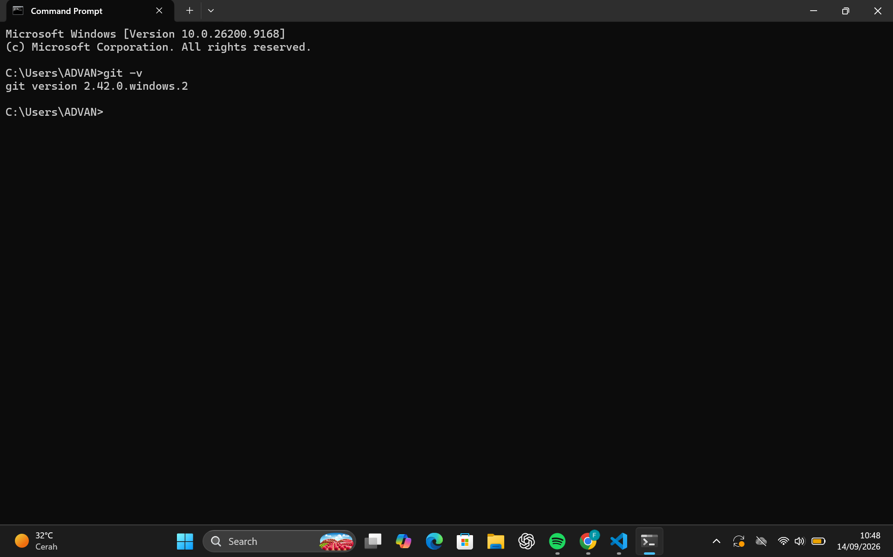
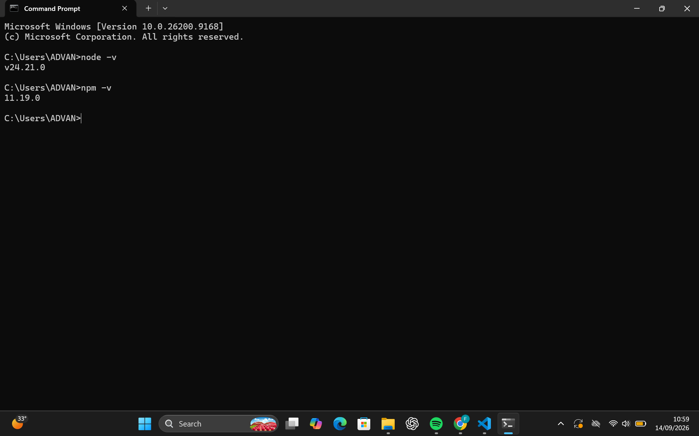
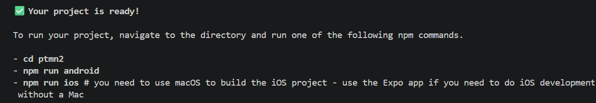
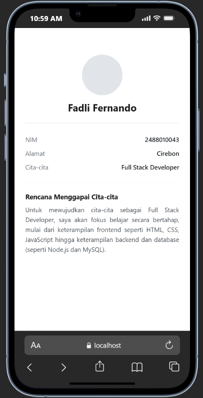

# Praktikum menyiapkan lingkungan pemngembangan dan memulai pemrogramnan mobile (React native) #

## Tujuan Pembelajaran ##
Mahasiswa mampu:
1. Menyiapkan lingkungan pengembangan dan memulai pemrohgraman mobile (React Native)
2. Membuat aplikasi mobile dengan react native
3. Menyelesaikan tugas CV sederhana dengan React Native

## Materi dan Laporan Praktikum ##
1. Menyiapkan Lingkungan pengembangan dan memulai pemrograman mobile (React Native)
 - Memastikan instalasi Git Bash
 - Cek Instalasi Git bash (git --version)
 - Bukti verifikasi
 

 - Memastikan Node.js dan NPM
 - Download dan install Node.js di https://nodejs.org/en/download/  
 - Konfirmasi Nodejs dan NPM (node -v, npm -v)
 

 2. Membuat aplikasi / Projek baru dengan React Native Framework Expo Go
 - Buka dan Baca link https://docs.expo.dev/
 - buka dan baca dokumentasi resmi link https://reactnative.dev/docs/getting/started
 - Memulai Membuat Projek baru
 - open terminal change directory ke pertemuan 2
 - masukan perintah (npx create-expo-app ptmn2 --template blank)
 - bukti verifikasi
 
 - Running Projek
 - Cd ke ptmn2
 - npx expo start
 - Install Expo Go di Android atau ios
 - bisa juga menggunakan web emulator dilaptop/pc
 - setelah itu bisa berhentikan dengan (CTRL + C)
 - install (npx expo install react-dom react-native-web)
 - npx expo start --web
 