# Laporan praktikum 3: core componen dan styling 

## langkah 1: import libary and componen

1. buka file appp.js yg ada di folder ptmn2
2. import libary dan componen yang diperlukan
3. konfirmasi bukti

## Langkah 2: Membuat array objek
1. buat objek array bernama profile
2. masukan data yang diperlukan
3. konfirmasi bukti

4. Buat objek array untuk DATA SKILLS
5. Konfirmasi bukti data skills

6. Buat array sections untuk DATA RIWAYAT
7. konfirmasi bukti data riwayat

8. membuat array social media
9. konfirmasi bukti

## Langkah 3: Sub-Components (skillcard dan timelinecard)
1. Buat komponen (SkillCard & TimelineCard) 
2. Masukkan komponen tersebut di antara data statis dan fungsi App()
3. Konfirmasi bukti
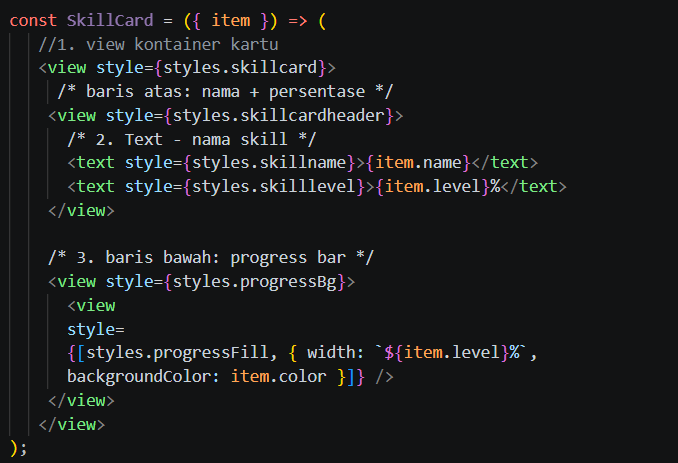
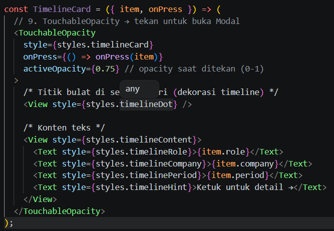

## Langkah 4: State Management dengan useState
1. Tambahkan state (useState) di dalam fungsi App() untuk menyimpan data yang bisa berubah
2. Konfirmasi bukti
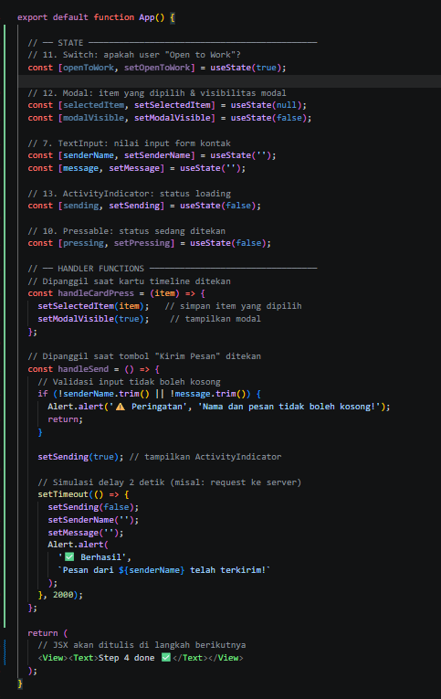

## Langkah 5: SafeAreaView, StatusBar & Header
1. Ganti return komponen menggunakan SafeAreaView agar aman dari notch layar
2. Tambahkan StatusBar dan buat header bar menggunakan View dan Switch
3. Konfirmasi bukti
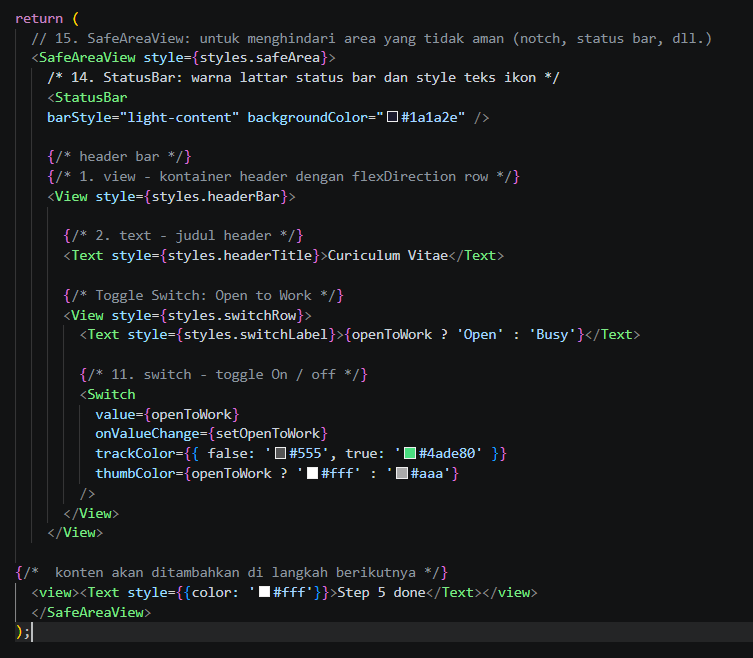

## Langkah 6: ScrollView & Profil Section
1. Tambahkan ScrollView untuk membungkus seluruh konten CV agar bisa di-scroll
2. Masukkan komponen Image, Text untuk profil, dan tombol sosial media
3. Konfirmasi bukti
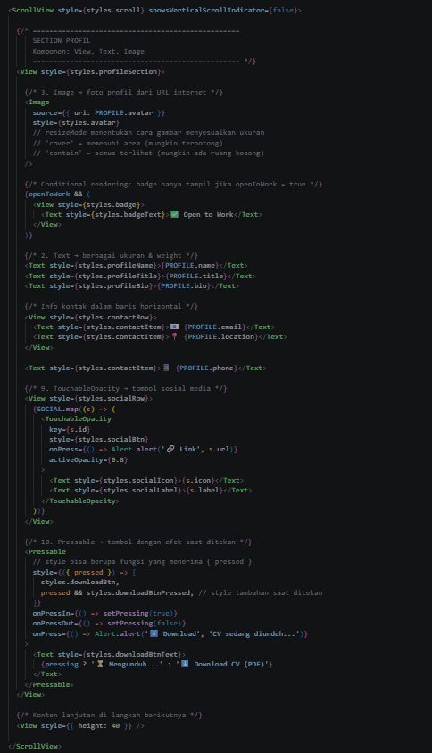

## Langkah 7: FlatList (Daftar Skills)
1. Tambahkan komponen FlatList di dalam ScrollView
2. Hubungkan data skills untuk di-render menjadi daftar yang efisien
3. Konfirmasi bukti
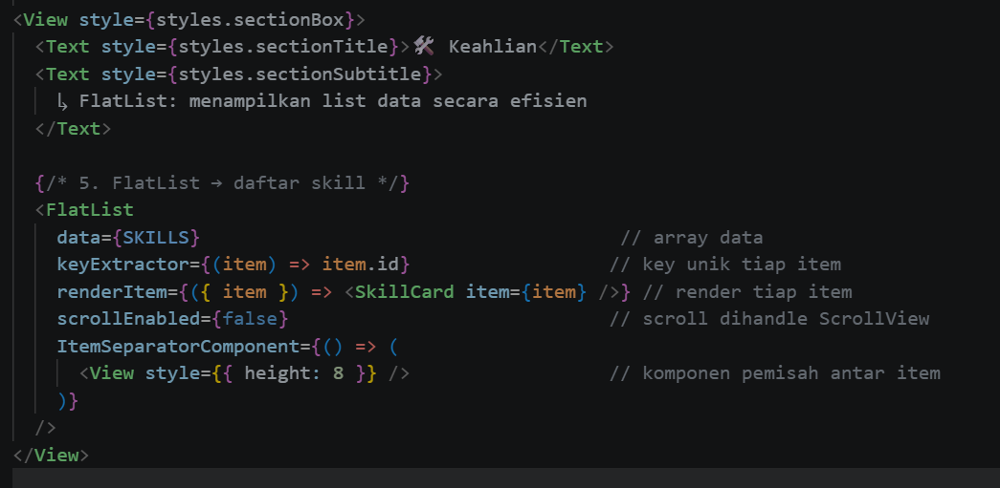

## Langkah 8: SectionList (Pengalaman & Pendidikan)
1. Tambahkan komponen SectionList untuk menampilkan data yang berkelompok
2. Hubungkan data riwayat pendidikan dan pengalaman kerja
3. Konfirmasi bukti
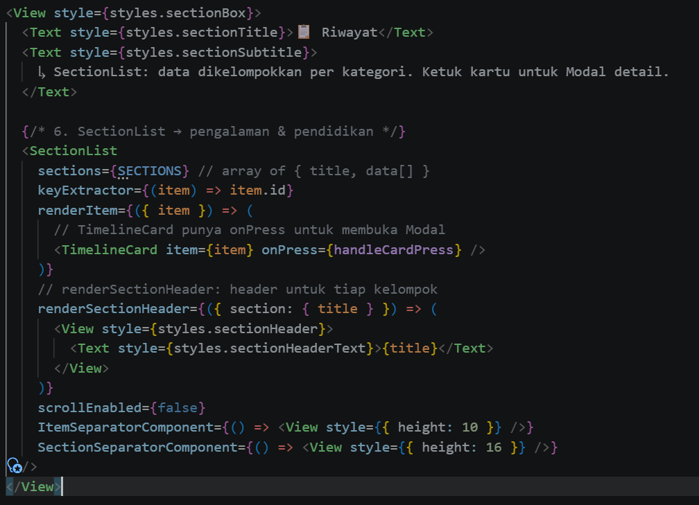

## Langkah 9: TextInput, Button & ActivityIndicator
1. Buat form kontak menggunakan komponen TextInput dan Button
2. Tambahkan ActivityIndicator untuk menampilkan spinner loading
3. Konfirmasi bukti
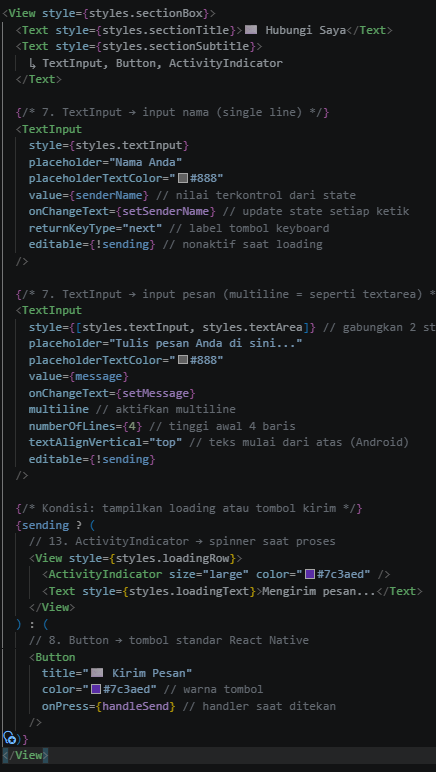

## Langkah 10: Modal (Popup Detail)
1. Tambahkan komponen Modal di luar ScrollView untuk menampilkan overlay
2. Konfirmasi bukti
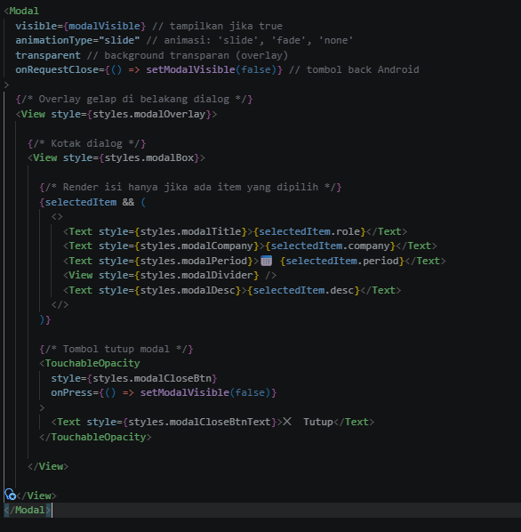

## Langkah 11: StyleSheet (Styling Terpusat)
1. Buat palet warna konstan
2. Konfirmasi bukti palet warna
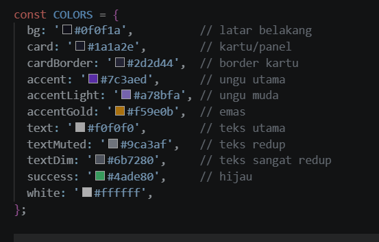

3. Buat inisialisasi StyleSheet.create()
4. Konfirmasi bukti inisialisasi
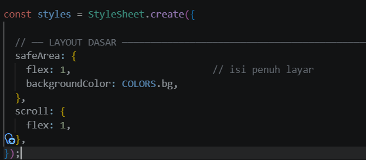

5. Tambahkan styling untuk Header Bar
6. Konfirmasi bukti Header Bar
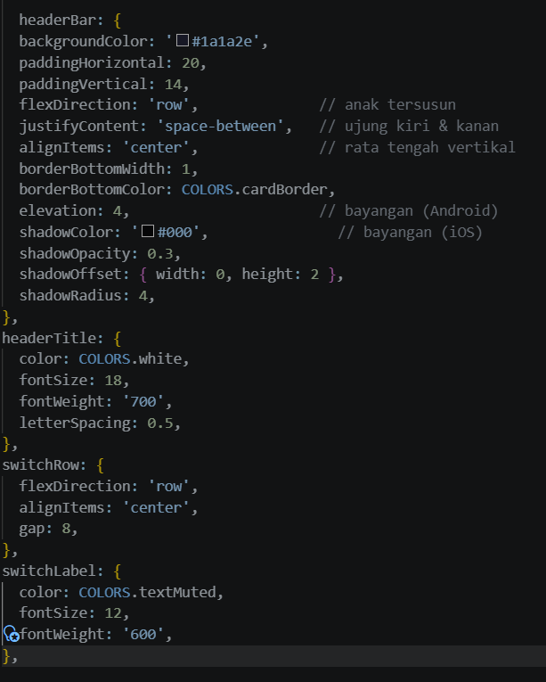

7. Tambahkan styling untuk Section Profil
8. Konfirmasi bukti Section Profil
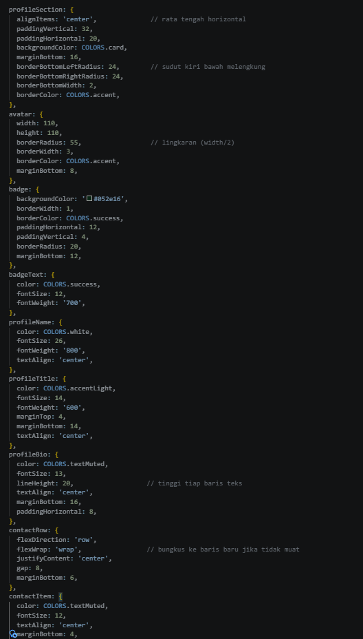

9. Tambahkan styling untuk Sosial Media
10. Konfirmasi bukti Sosial Media
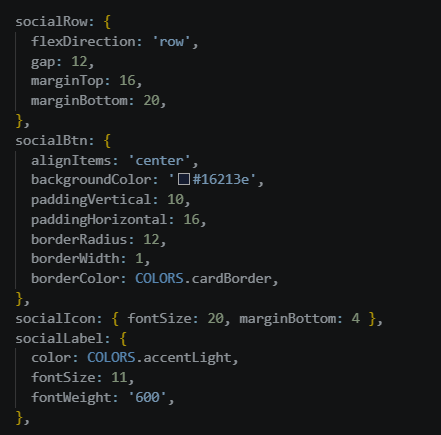

11. Tambahkan styling untuk Pressable Download
12. Konfirmasi bukti Pressable Download
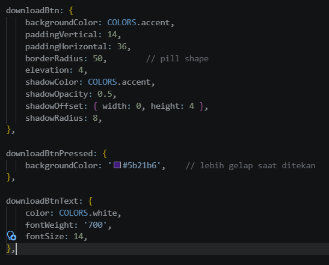

13. Tambahkan styling untuk Section Box
14. Konfirmasi bukti Section Box
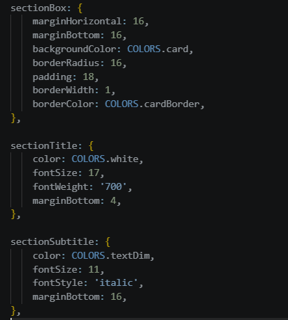

15. Tambahkan styling untuk Section List Header
16. Konfirmasi bukti Section List Header
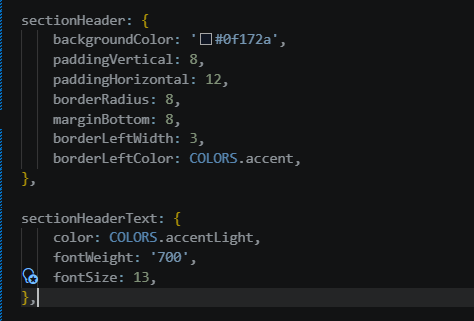

17. Tambahkan styling untuk Skill Card
18. Konfirmasi bukti Skill Card
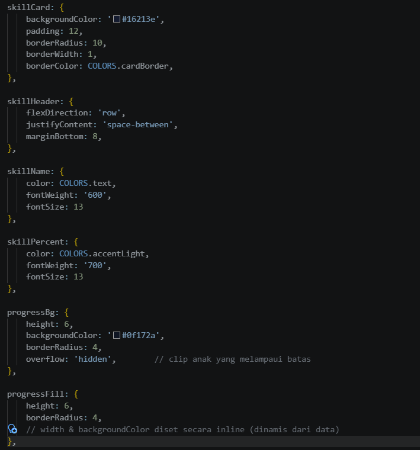

19. Tambahkan styling untuk Timeline Card
20. Konfirmasi bukti Timeline Card
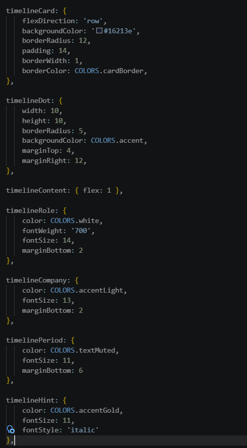

21. Tambahkan styling untuk Text Input
22. Konfirmasi bukti Text Input
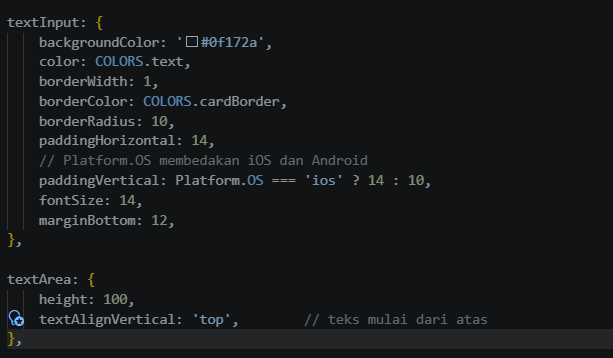

23. Tambahkan styling untuk Loading Row
24. Konfirmasi bukti Loading Row
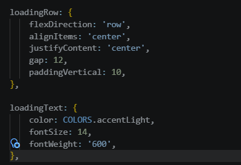

25. Tambahkan styling untuk Modal
26. Konfirmasi bukti Modal
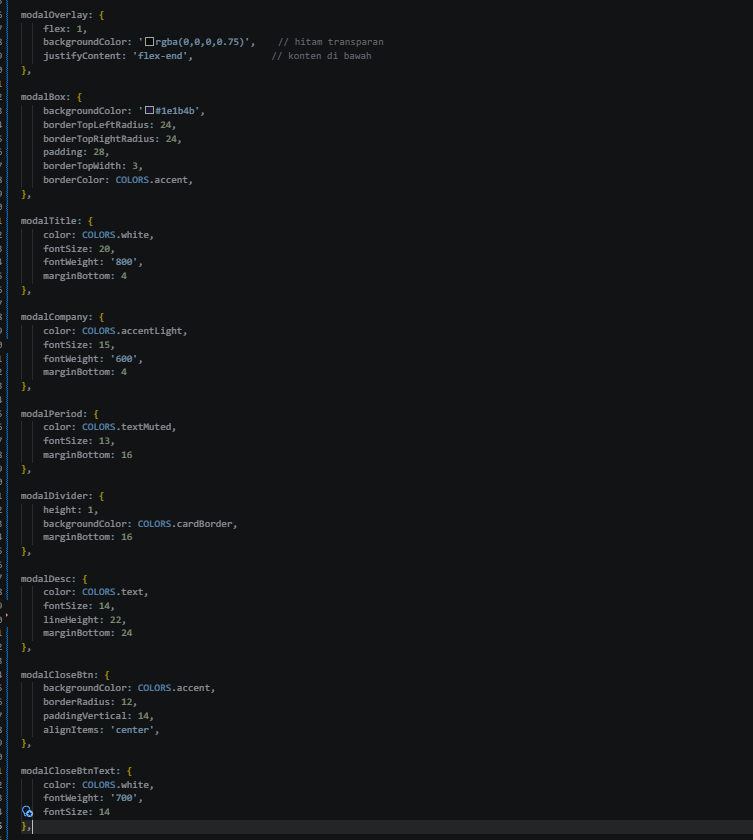

27. konfirmasi hasil
