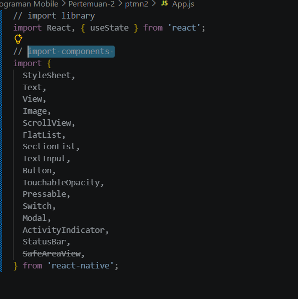
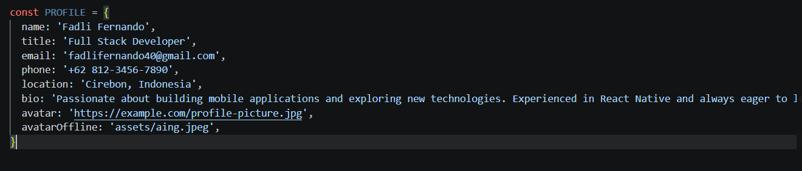
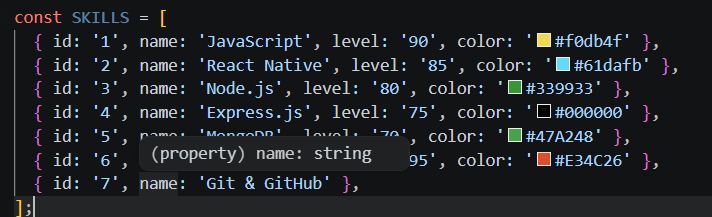
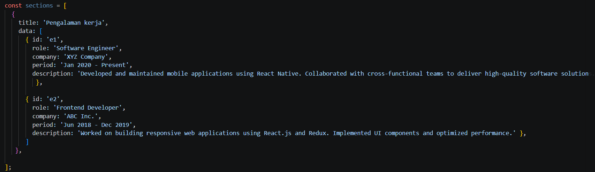
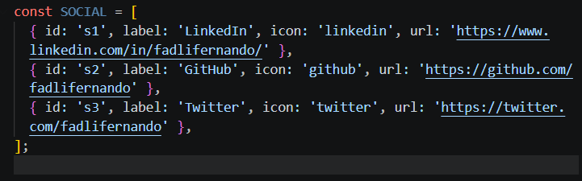

# Laporan praktikum 3: core componen dan styling 

## langkah 1: import libary and componen
1. buka file appp.js yg ada di folder ptmn2
2. import libary dan componen yang diperlukan
3. konfirmasi bukti

## Langkah 2: Membuat array objek
1. buat objek array bernama profile
2. masukan data yang diperlukan
3. konfirmasi bukti

4. Buat objek array untuk DATA SKILLS
5. Konfirmasi bukti data skills

6. Buat array sections untuk DATA RIWAYAT
7. konfirmasi bukti data riwayat

8. membuat array social media
9. konfirmasi bukti

## Langkah 3: Sub-Components (skillcard dan timelinecard)

## Langkah 4: State Management dengan useState

## Langkah 5: SafeAreaView, StatusBar & Header

## Langkah 6: ScrollView & Profil Section

## Langkah 7: FlatList (Daftar Skills)

## Langkah 8: SectionList (Pengalaman & Pendidikan)

## Langkah 9: TextInput, Button & ActivityIndicator

## Langkah 10: Modal (Popup Detail)

## Langkah 11: StyleSheet (Styling Terpusat)

## konfirmasi hasil
