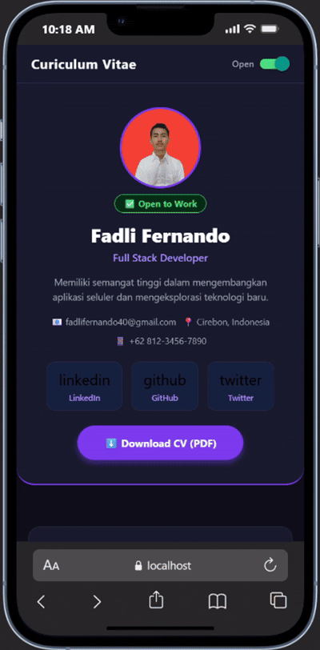

# Laporan praktikum 3: core componen dan styling 

## langkah 1: import libary and componen

1. buka file appp.js yg ada di folder ptmn2
2. import libary dan componen yang diperlukan
3. konfirmasi bukti

## Langkah 2: Membuat array objek
1. buat objek array bernama profile
2. masukan data yang diperlukan
3. konfirmasi bukti

4. Buat objek array untuk DATA SKILLS
5. Konfirmasi bukti data skills

6. Buat array sections untuk DATA RIWAYAT
7. konfirmasi bukti data riwayat

8. membuat array social media
9. konfirmasi bukti

## Langkah 3: Sub-Components (skillcard dan timelinecard)
1. Buat komponen (SkillCard & TimelineCard) 
2. Masukkan komponen tersebut di antara data statis dan fungsi App()
3. Konfirmasi bukti

## Langkah 4: State Management dengan useState
1. Tambahkan state (useState) di dalam fungsi App() untuk menyimpan data yang bisa berubah
2. Konfirmasi bukti

## Langkah 5: SafeAreaView, StatusBar & Header
1. Ganti return komponen menggunakan SafeAreaView agar aman dari notch layar
2. Tambahkan StatusBar dan buat header bar menggunakan View dan Switch
3. Konfirmasi bukti

## Langkah 6: ScrollView & Profil Section
1. Tambahkan ScrollView untuk membungkus seluruh konten CV agar bisa di-scroll
2. Masukkan komponen Image, Text untuk profil, dan tombol sosial media
3. Konfirmasi bukti

## Langkah 7: FlatList (Daftar Skills)
1. Tambahkan komponen FlatList di dalam ScrollView
2. Hubungkan data skills untuk di-render menjadi daftar yang efisien
3. Konfirmasi bukti

## Langkah 8: SectionList (Pengalaman & Pendidikan)
1. Tambahkan komponen SectionList untuk menampilkan data yang berkelompok
2. Hubungkan data riwayat pendidikan dan pengalaman kerja
3. Konfirmasi bukti

## Langkah 9: TextInput, Button & ActivityIndicator
1. Buat form kontak menggunakan komponen TextInput dan Button
2. Tambahkan ActivityIndicator untuk menampilkan spinner loading
3. Konfirmasi bukti

## Langkah 10: Modal (Popup Detail)
1. Tambahkan komponen Modal di luar ScrollView untuk menampilkan overlay
2. Konfirmasi bukti

## Langkah 11: StyleSheet (Styling Terpusat)
1. Buat palet warna konstan
2. Konfirmasi bukti palet warna

konfirmasi hasil

