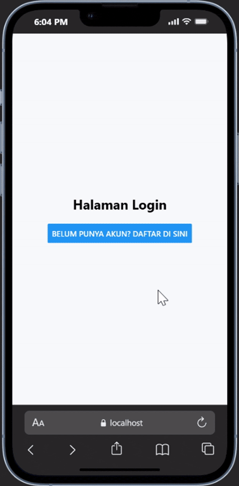
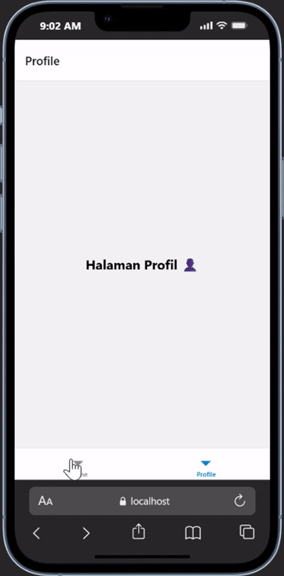
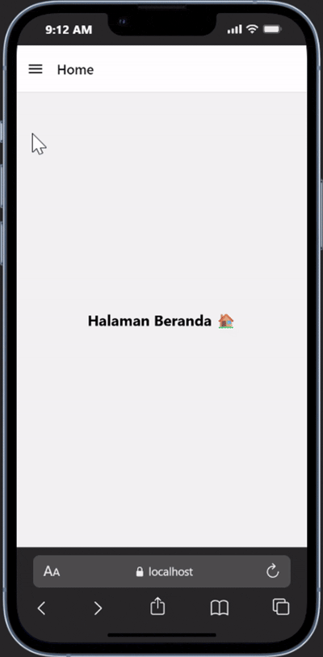

## praktikum react native navigation

## Tujuan Pembelajaran
mahasiswa mampu : 
1. merancang dan menerapkan navigasi antar layar pada aplikasi react native
2. menggunakan library react native navigation ( stack, tab, drawer navigation )

## alur praktikum

### langkah 1: inisialisasi proyek react native ##
1. buka terminal atau cmd
2. ubah directori ke folder pertemuan 4 (cd  "Pemrograman mobile")
3. buat projek baru menggunakan perintah : 'npx create-expo-app ptmn4 --template blank'
4. masuk ke dalam folder proyek menggunka perinta: 'cd ptmn4'
5. Install core navigation library - npm install @react-navigation/native
6. Install dependensi pendukung (wajib untuk Expo) - npx expo install react-native-screens react-native-safe-area-context react-native-gesture-handler react-native-reanimated

### langkah 2: membuat stack navigator
1. instal pustaka stack - npm install @react-navigation/native-stack
2. buat folder didalam projek dengan nama screens
3. didalam folder screens buat buat 2 file dengan nama Login.js dan Signup.js
4. masukan kode sesuai pada modul praktikum 4
5. sesuaikan file App.js dengan kode yang ada pada modul
6. Simpan dan Install dependensiuntuk web "npx expo install react-dom react-native-web"
7. jalankan perintah npx expo start --web
8. konfirmasi bukti

### Langkah 3: Membuat Bottom Tab Navigation ###
1. Instalasi Pustaka Bottom Tabs (npm install @react-navigation/bottom-tabs)
2. Buat file HomeScreen.js dan ProfileScreen.js di dalam folder screens.
3. Masukan kode sesuai pada modul praktikum 4.
3. Ubah kode App.js, sesuaikan dengan modul praktikum
4. konfirmasi bukti

### Langkah 4: Membuat Drawer Navigation
1. Instalasi Pustaka Drawer (npm install @react-navigation/drawer)
2. Ubah kembali file App.js sesuai dengan code pada module
3. Konfirmasi Bukti

